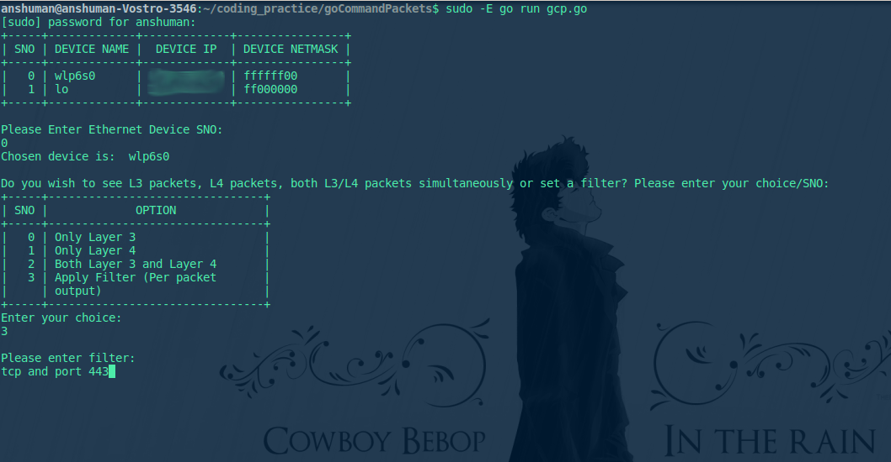
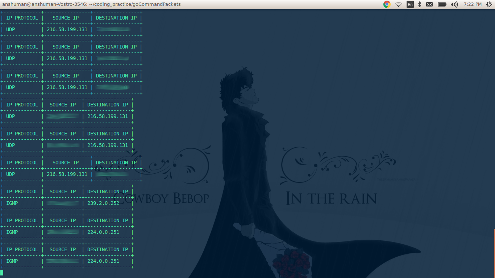
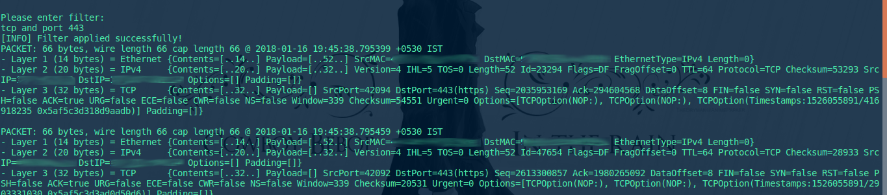

## goCommandPackets 
##### A command line utility based on gopacket and libpcap-dev to scan and inspect packets and internet traffic

### Dependencies 
- ```gopacket```
- ```tablewriter```
- ```libpcap-dev```

##### To install these run the following commands (Ubuntu):
- ```go get github.com/google/gopacket```
- ```go get github.com/olekukonko/tablewriter```
- ```sudo apt-get install libpcap-dev```

### Usage

`goCommandPackets` is very easy to use since it asks you for your inputs and the kind of inspection/scanning you would like to undertake. It is still in it's nascent stages of development.

First run the script using `sudo -E` as you might need to reference your GOPATH in the environment to  `sudo` (hence, the `-E` flag). `sudo` is required because we need superuser privileges to inspect traffic using `libpcap`:

Therefore to run the script, type the following in terminal:  `sudo -E go run gcp.go`

There are a number of things that the user can request for:

* First submit the SNO of your connection interface (wlp6s0 in this example)
* Then choose any of the four currently available options: IP Layer traffic, TCP layer traffic, Both TCP/IP traffic and using filters for getting a particular set of packets from the traffic: (As an example we choose Option 3 with filter `tcp and port 443`):

* Finally inspect the traffic! 
	*  In case of Option 2 (All traffic enabled) the output might look like this:
		
	*  In case of Option 3 (Using a filter) the output might look like this for `tcp and port 443` filter:
		
